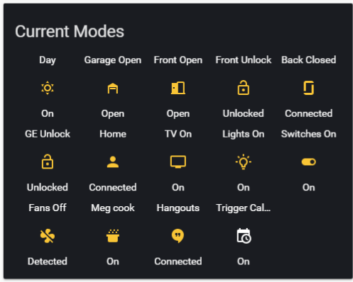
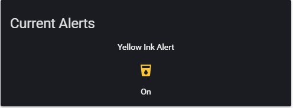
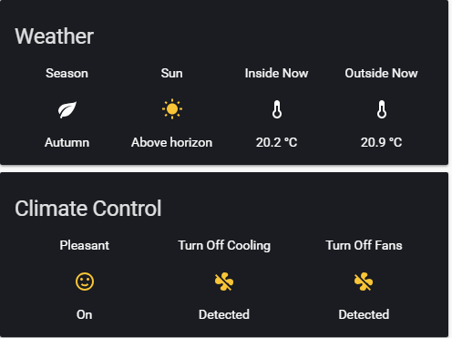
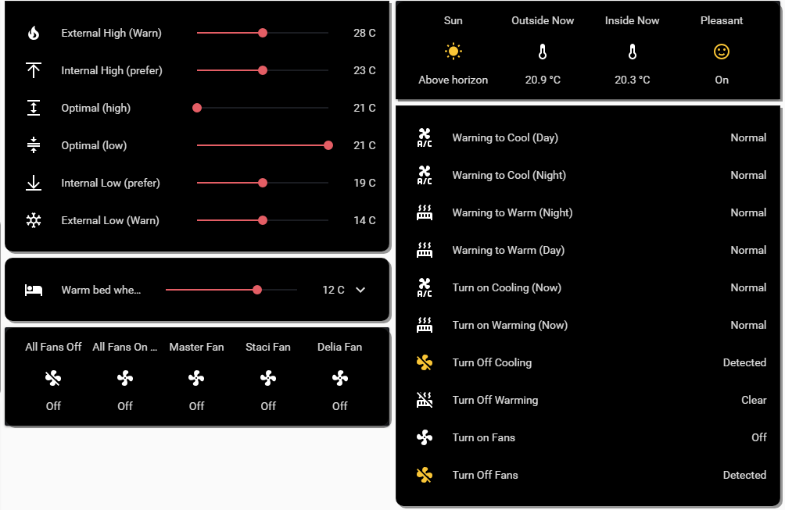
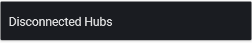

# Rushbrook Overlook Configuration

Software: [Home Assistant](https://home-assistant.io)
Version: 0.90.1

*special note: If user gets completely locked out
Remove both .storage/auth* and .storage/onboarding to restart the onboarding process and create a new user.

## Hardware

I am using a Raspberry Pi 3B+ using [HassOS](https://github.com/home-assistant/hassos) and [HassIO](https://github.com/home-assistant/hassio).

I run headless, and use Samba to update the configuration.

## Add-ons

[HassIO](https://github.com/home-assistant/hassio) Add-ons in use;

To update the configuration over the network
[Samba Share](https://home-assistant.io/addons/samba/)

To keep the appropriate IP address for the dynamic DNS
[Duck DNS](https://www.home-assistant.io/addons/duckdns/)

Occasionally I need to SSH into the Pi, this isn't always turned on
[SSH & Web Terminal](https://github.com/hassio-addons/addon-ssh)

Some of the more complicated automation is done here
[Appdaemon](https://github.com/hassio-addons/addon-appdaemon3)

To do network wide ad-blocking
[Pi-hole](https://github.com/hassio-addons/addon-pi-hole)

Before updating to the new version, run this to make sure you won't get odd results
[Check Home Assistant configuration](https://home-assistant.io/addons/check_config)

## Custom Components

To keep up to date with the lovelace cards and supported custom components
[Custom_Updater](https://github.com/custom-components/custom_updater) and/or [HACS](https://github.com/custom-components/hacs)

To get a better view of the Buses in Canberra I use the updated code and the recommendations on adjusting the size of the database
[GTFS](https://github.com/renemarc/home-assistant-config/tree/master/gtfs)

To get access to the Hue remote controls, I use
[HueSensor](https://github.com/robmarkcole/Hue-sensors-HASS)

## Main Configuration

  
Statements with additional information
homeassistant: / frontend: / lovelace: / recorder: / http: / logger: / tts:
  
Statements with no additional information
introduction: / config: / updater: / discovery: / conversation: / history: / logbook: / map: / system_health: / sun: / person: 

I don't use the cloud: component.

## Devices 

[Samsung Smartthings](https://www.smartthings.com/) Wifi Hub, motion sensors, multifunction sensors, washing machine & dryer
[Phillips Hue](https://www2.meethue.com/en-au) Lights, motion sensors, remote controls
[Logitech Harmony Hub](https://www.logitech.com/en-au/harmony-universal-remotes) Remote control
[Kevo Locks](https://www.kwikset.com/kevo/plus) Locks (through custom python code in appdaemon)
[Nest Protect](https://nest.com/au/) Fire Alarms
[Netgear Orbi](https://www.netgear.com.au/orbi/) Orbi Mesh Router
[Chamberlain Myq](https://www.myq.com/) Myq Garage Door Opener
[Bond.io](https://bondhome.io/) IR Fan controller (through IFTTT Webhooks)
[Google Home & Chromecast](https://www.google.com.au/chromecast/setup/) Media controls, alarms and timers

## Integrations/Components

### Device Tracking, zones & proximity

[GPSLogger](https://www.home-assistant.io/components/gpslogger/) - integration
[Nmap](https://www.home-assistant.io/components/device_tracker.nmap_tracker/) - configuration.yaml
[Netgear](https://www.home-assistant.io/components/device_tracker.netgear/) - configuration.yaml
[trackr](https://www.home-assistant.io/components/device_tracker.trackr/) - configuration.yaml
[huesensor](https://github.com/robmarkcole/Hue-sensors-HASS) - configuration.yaml
[Zone](https://www.home-assistant.io/components/zone/) - zone.yaml
[Proximity](https://www.home-assistant.io/components/proximity/) - proximity.yaml

### Weather Tracking

[BOM Sensor](https://www.home-assistant.io/components/sensor.bom/) - sensor.yaml
[Dark Sky Weather](https://www.home-assistant.io/components/weather.darksky/) - configuration.yaml
[Dark Sky Sensor](https://www.home-assistant.io/components/sensor.darksky/) - sensor.yaml
[Season](https://www.home-assistant.io/components/sensor.season/) - sensor.yaml

### Devices (Fire alarms, garage door, lights, motion & multifunction sensors, switches, remote controls, streaming, locks, printer)

[Appdaemon](https://www.home-assistant.io/docs/ecosystem/appdaemon/) - appdaemon/apps.yaml AND appdaemon/apps/kevo/locks.py
This also requires pykevoplus & bs4 python libaries to work

[Nest](https://www.home-assistant.io/components/nest/) - integration via configuration.yaml 
[Myq](https://www.home-assistant.io/components/cover.myq/) - configuration.yaml
[Phillips Hue](https://www.home-assistant.io/components/hue/) - configuration.yaml AND integration
[Huesensor](https://github.com/robmarkcole/Hue-sensors-HASS) - custom component
[Smartthings](https://www.home-assistant.io/components/smartthings/) - integration
[TP-Link](https://www.home-assistant.io/components/tplink/) - integration
[Google Cast](https://www.home-assistant.io/components/cast/) - integration
[Harmony Hub](https://www.home-assistant.io/components/harmony/) - 
[Epson Printer](https://www.home-assistant.io/components/sensor.command_line/) - sensor.yaml (command line)
[Batteries](https://www.home-assistant.io/components/sensor.template/) - sensor.yaml (template)
[GPS last updated](https://www.home-assistant.io/components/sensor.template/) - sensor.yaml (template)
[TP-Link Switch Energy Usage](https://www.home-assistant.io/components/sensor.template/) - sensor.yaml (template)
[Torque](https://www.home-assistant.io/components/sensor.torque/) - sensor.yaml (DOES NOT WORK through HTTPS, not being used)
[Hue Motion Sensors](https://www.home-assistant.io/components/sensor.rest/) - sensor.yaml

### System monitoring

[System Monitor](https://www.home-assistant.io/components/sensor.systemmonitor/) - sensor.yaml
[Pi-hole](https://www.home-assistant.io/components/sensor.pi_hole/) - sensor.yaml
[Check External IP](https://www.home-assistant.io/components/sensor.rest/) - sensor.yaml
This is used to check, and if the ip has changed, it reconnects hangouts

### Transport, Car and Bus

[Waze Travel Time](https://www.home-assistant.io/components/sensor.waze_travel_time/) - sensor.yaml
[GTFS](https://github.com/renemarc/home-assistant-config/tree/master/gtfs) - custom_component AND sensory.yaml

### Timers and Alarms

[Google Home](https://www.home-assistant.io/components/googlehome/) - configuration.yaml
[Timers](https://www.home-assistant.io/components/timer/) - timer.yaml

### Automation and state control

[IFTTT](https://www.home-assistant.io/components/ifttt/) - configuration.yaml for sending webhooks
[IFTTT](https://www.home-assistant.io/components/ifttt/) - integration for receiving webhooks
[Appdaemon](https://www.home-assistant.io/docs/ecosystem/appdaemon/) - appdaemon/apps.yaml AND appdaemon/apps
[Automation](https://www.home-assistant.io/components/automation/) - automation yaml files in /automations
[Script](https://www.home-assistant.io/components/script/) - scripts.yaml

[Input Select](https://www.home-assistant.io/components/input_select/) - input_select.yaml
[Input Boolean](https://www.home-assistant.io/components/input_boolean/) - input_boolean.yaml
[Input Number](https://www.home-assistant.io/components/input_number/) - input_number.yaml
[Binary Sensor](https://www.home-assistant.io/components/binary_sensor.template/) - binary_sensor.yaml

### Conversations & Notifications

[Google Hangout Intents](https://www.home-assistant.io/components/hangouts/) - integration AND hangouts.yaml AND hangout_intent_scripts.yaml
[Google Assistant](https://www.home-assistant.io/components/google_assistant/) - ga.yaml ***this is recorded as google_assistant: in configuration.yaml
[Google Hangouts](https://www.home-assistant.io/components/hangouts/) - integration
[Pushbullet](https://www.home-assistant.io/components/notify.pushbullet/) - notify.yaml
[SMTP](https://www.home-assistant.io/components/notify.smtp/) - notify.yaml

### Calendars

[Google Calendar](https://www.home-assistant.io/components/calendar.google/) - calendar.yaml ***this is recorded as google: in configuration.yaml
Calendars - sensor.yaml
[Time & Date](https://www.home-assistant.io/components/sensor.time_date/) - sensor.yaml

### User Interface

[Group](https://www.home-assistant.io/components/group/) - groups.yaml
[Lovelace](https://www.home-assistant.io/lovelace/) - configuration.yaml AND ui-lovelace.yaml
[Tracker Card](https://github.com/custom-cards/tracker-card) - ui-lovelace.yaml
[Waze Card](https://github.com/ljmerza/waze-card) - ui-lovelace.yaml
[HA Dashboard](https://www.home-assistant.io/docs/ecosystem/hadashboard/) - appdaemon/dashboards

## Modes

These different concepts spawn alerts, automations or just update the UI

### Home

There are four (4) time modes for the house to be in, Morning, Day, Evening & Night. 

*Morning* starts at 6am and turns on a number of lights and resets switches and motion sensors if they have been turned off.
Morning can be triggered through a calendar entry #morning if you need it to start earlier for a certain day.

*Day* starts at 9am and turns all the lights off. Day is automatically triggered when everyone is 'not_home' and it is before 6pm.

*Evening* starts 30mins before sunset, different lights and switches are triggered.

*Night* starts at 10pm, turning off all lights (except for the bedroom lights). Lights will be turned on if the presence changes to a *home* state on a 10 min timer.

### Presence

There are a number of different presence options, All Home, All Away, Someone Home, Guest.

*All Home* is set when all the watched devices are in the home zone or connected to the wifi.

*All Away* is set when all the watched devices are not in the home zone and not connected to the wifi.

*Someone Home* is set when at least one watched device or the *Guest* flag is turned on.

*Guest* can be set either manually or by placing a calendar entry #guest (turning on at start and turning off at end of event).

### Messages

There are two main options for messaging, Hangouts or Pushbullet, the house will default to Hangouts, but it can be manually changed to Pushbullet if it is noticed that the notifications are not working and a restart cannot be performed.

### Travel

There are quite a few different travel options, entering and leaving zones can start timers and if other zones are entered within a certain time, assumptions are made about buses that people may be on. 

Bus times from a number of bus stops are shown as well as the house trying to 'guess' if people are travelling in the car or walking/bus to determine what to do with locks and the garage door when arriving home.

The latest method uses Tasker/IFTTT to see if someone is reaching home while connected to the car, and will open the garage door. These are works in progress with a number of different options having been tried, with proximity sensors and torque (which would be the most effective but doesn't seem to work with https).

### Status

A large number of mutually exclusive values that can then be used by entity-filter cards in lovelace to only show the current state of those items in a glance view for a mobile. Covers whether doors are closed and locked, lights, fans, switches, TV, whose is cooking, messaging option, certain errors are available.

### Cooking

Uses a calendar entry using #cook, to set the person cooking that day.

### Driving

Tasker/IFTTT notify HA when a person is connected to the car bluetooth (assumed to be driving).

### Alerts

A number of different alerts, for printer ink, cpu and disk usage and batteries low trigger messages and show on the mobile glance page.

### Climate

A mechanism to let us know if the heating and cooling should be on or off (only done in particular seasons), and turns the fans on and off based upon an 'optimal' temperature range in and outside the house. A second option to trigger to turn on bed warmers is yet to be tested when we can get the appropriate electric blankets/throws and additional switches.

### Network

A set of sensors that looks at the devices on the network and if certain hubs/devices disappear a notification will be shown on the glance mobile page.

### GPS Reporting

This sensor aims to see how long since the GPSLogger has updated while away from home, if it has not reported for an hour it warns the individual that their logging is not working correctly. This seems to work intermittantly, think it needs something to trigger it.
